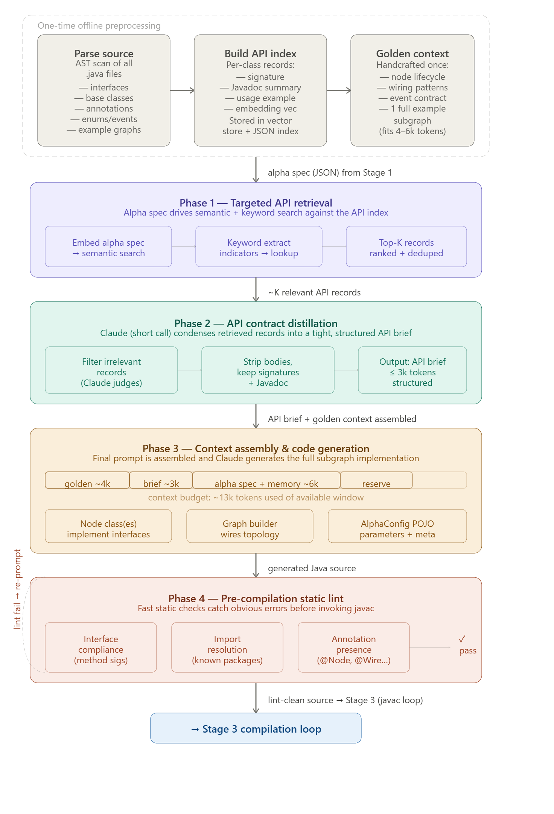
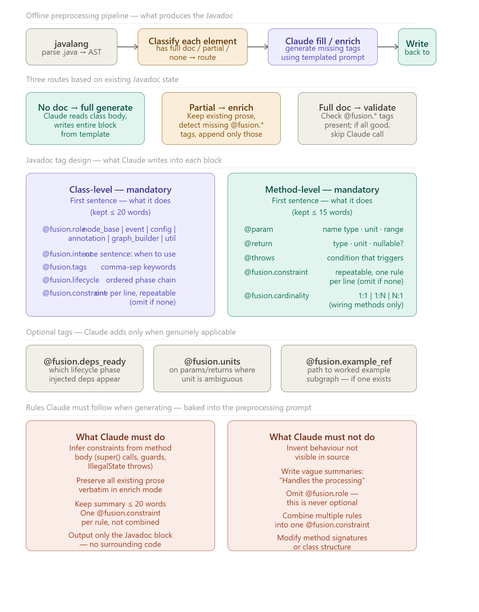
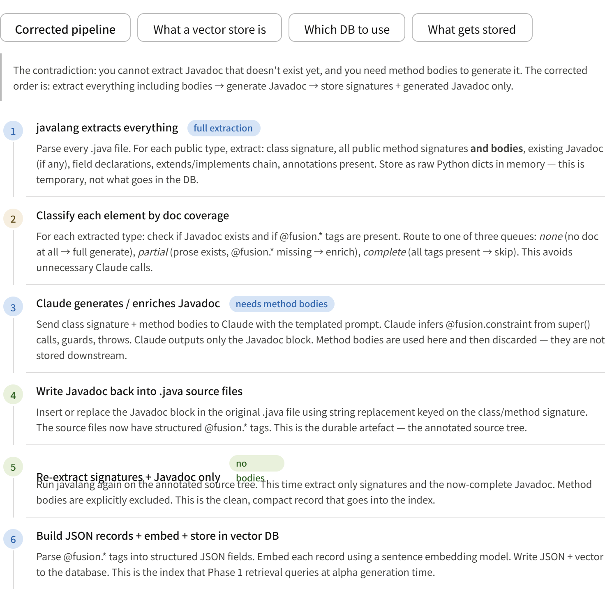

Stage 1 — Alpha ideation. Claude Sonnet receives a system prompt embedding the Fusion framework's node/graph API conventions plus any accumulated memory from prior iterations. It generates a structured alpha spec in JSON — signal logic (entry/exit conditions), indicator choices, and parameter rationale. The memory context from Stage 5 is what makes this improve over time: Claude knows what it tried, what worked, and why.

Stage 2 — Fusion subgraph code generation. Claude translates the alpha spec into Java source: node class definitions implementing your Fusion interfaces, the graph wiring (which nodes connect to which), event handlers subscribing to tick/bar events, and a config object holding the parameters. The system prompt here must include your Fusion API signatures, base node contracts, and example subgraphs so Claude generates code that actually conforms to the framework.
Stage 3 — Compilation loop. This is an agentic retry loop. The orchestrator runs javac or Maven, captures stdout/stderr, and feeds errors back to Claude with the original source. Claude patches or rewrites the problematic sections and tries again. Three to five iterations is typically enough for Claude to resolve type mismatches, missing imports, and API misuse. You set a max-retry ceiling and surface a failure report if it can't compile.

Stage 4 — Backtest via master graph. Your pre-built master graph instantiates the compiled alpha subgraph, wires it to the historical data feed node, and runs the full tick replay. The assessment node collects Sharpe ratio, max drawdown, win rate, PnL curve, and trade log. This emits a structured performance JSON.

Stage 5 — Memory synthesis. Claude is prompted to write a concise structured summary: what the alpha does, what parameters it used, what the backtest showed, and what hypotheses might improve it. This summary is persisted (a vector store, a flat JSON file, or Claude's own memory tool). On the next iteration of Stage 1, this memory is injected into the ideation prompt, enabling genuine incremental improvement.

# Key implementation considerations:
The system prompt for Stage 2 is load-bearing — it needs your full Fusion node interface contracts, the subgraph registration mechanism, and at least one worked example. Without that, Claude will hallucinate method signatures.

For Stage 3, always pass the full source plus the compiler error — not just the error. Claude needs the source context to apply the right patch.

For Stage 5 memory, a structured schema works better than free-form prose: {alpha_id, hypothesis, indicators, params, sharpe, max_dd, win_rate, notes, suggested_improvements}. This makes it easy to filter and rank past alphas and to prompt Claude with the top-N results.

The key insight is splitting the problem into what happens once offline versus what happens per alpha generation. Here's the reasoning for each phase:

Offline preprocessing (one-time, not per alpha). You run an AST parser (e.g. JavaParser) over the entire Fusion source tree and extract structured records for every interface, abstract base class, annotation, event type, and enum — just signatures and Javadoc, not method bodies. Each record gets a vector embedding and is stored in a lightweight vector store (Chroma, pgvector, or even a plain FAISS index). You also handcraft a "golden context" document once: the node lifecycle contract, the standard wiring patterns, the event subscription model, and one complete worked example subgraph. This golden context is the stable, dense, authoritative reference that never changes between alphas — keep it under 5k tokens.

Phase 1 — Targeted retrieval. When a new alpha spec arrives from Stage 1, you run two retrieval passes in parallel: semantic similarity search using the alpha spec's embedding against the index, and keyword extraction (indicator names, event types, config fields mentioned in the spec) for exact-match lookup. The union is ranked and deduplicated, giving you the top-K most relevant API records for this specific alpha idea — typically 20–40 records, far fewer than the full codebase.

Phase 2 — Distillation. A short, cheap Claude call (low max_tokens) receives those K records and compresses them further. It strips implementation bodies, keeps only method signatures and the single most useful Javadoc sentence per method, and flags any records it judges as irrelevant to the alpha. The output is a structured "API brief" that fits comfortably in 2–3k tokens. This step is important because raw retrieved records often contain noise — overloaded methods, deprecated variants, internal utilities — that would confuse the generation step.

Phase 3 — Assembled context and generation. Now you have a predictable, bounded context: golden context (~4k), API brief (~3k), alpha spec plus memory from Stage 5 (~6k), leaving the rest of the window for the generated output. Claude generates the full subgraph implementation in one shot — the node classes, graph builder, and config POJO — with accurate API knowledge and no hallucinated method names.

Phase 4 — Pre-compilation lint. Before invoking javac, a fast programmatic checker scans the generated source against the API index: are all implemented method signatures present in the known interfaces? Are the imports resolvable against known package paths? Are required annotations (@Node, @Wire, etc.) present where expected? This catches the most common generation errors — wrong parameter types, missing overrides, phantom imports — in milliseconds, giving Claude a tight feedback signal before the slower compilation step. Only lint-clean code proceeds to Stage 3's full compilation loop.

Why this matters for your compile rate. The biggest driver of compilation failures is Claude not knowing the exact API surface. By giving it a precisely targeted, distilled API brief rather than hoping it remembers from training, you should see a substantially higher first-attempt compile rate — meaning fewer iterations in Stage 3 and faster overall throughput.

The contradiction: you cannot extract Javadoc that doesn't exist yet, and you need method bodies to generate it. The corrected order is: extract everything including bodies → generate Javadoc → store signatures + generated Javadoc only.

